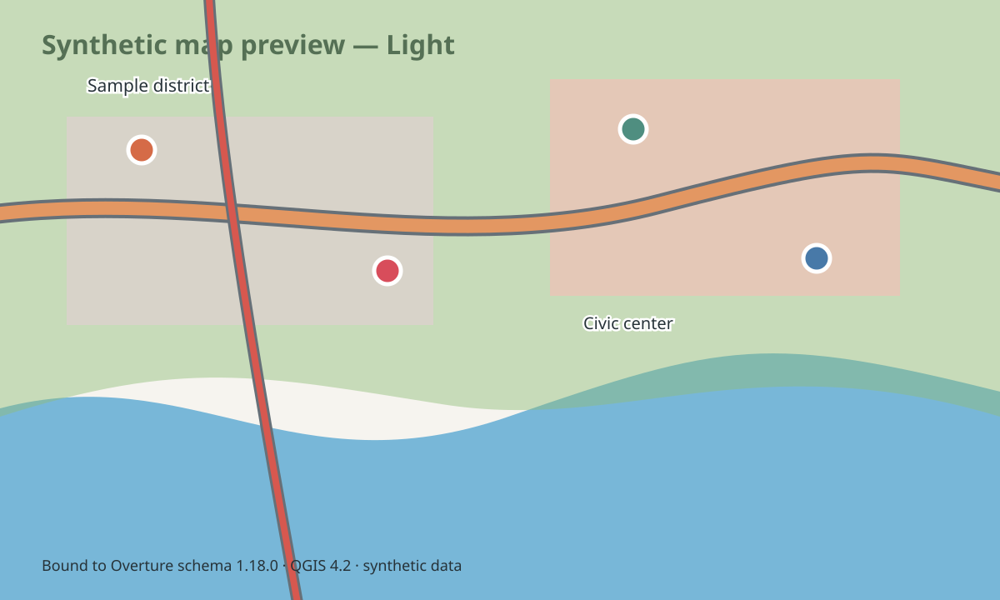
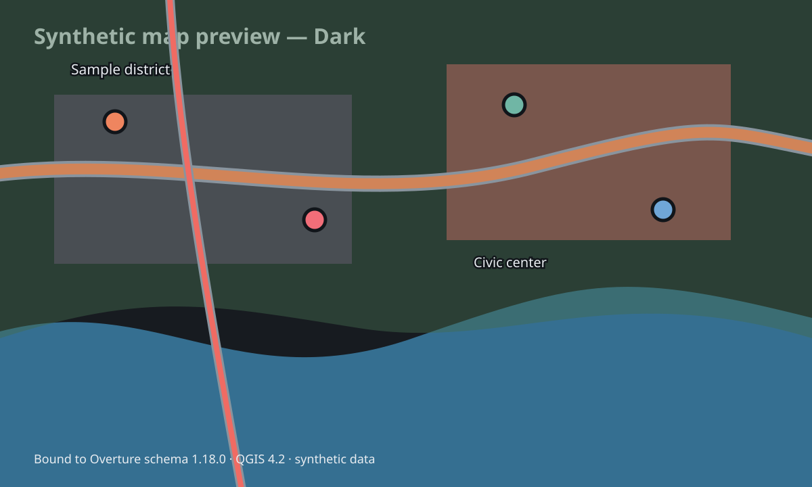

# QGIS styles for Overture schema 1.18.0

> **Compatibility boundary:** these styles are bound to Overture schema
> **1.18.0** and QGIS **4.2**. Other Overture schema versions are unverified.
> Run the included validator before applying a style to data from another
> workflow or release.

The [official release history](https://docs.overturemaps.org/release-calendar/)
assigns schema 1.18.0 to data releases `2026-07-22.0` and `2026-08-19.0`.
This is a schema binding, not a claim of forward compatibility: in particular,
the Places rules are not asserted to be compatible with any post-1.18.0 Places
schema.

This offline package provides coordinated Light Neutral and Dark cartography
for raw Overture GeoParquet fields as exposed by QGIS/OGR. It does not require
flattening fields such as `names.primary`, `taxonomy.hierarchy`, or
`cartography.min_zoom`, and it does not load fonts, icons, tiles, or scripts
from the network. Parameterized SVG sources are included under `symbols/`; the
same SVGs are embedded in the QML as base64 so the pictograms remain portable
without configuring an SVG search path.





## Included styles

Each palette contains 19 QML files under `styles/light` or `styles/dark`:

- Base bathymetry and land-cover polygons.
- Point, line, and polygon variants for Base infrastructure, land, land use,
  and water.
- Building and building-part polygons.
- Place points.
- Transportation segment lines and connector points.

Mixed-geometry GeoParquet should be split or filtered by geometry family, then
loaded with the matching `-point`, `-line`, or `-polygon` QML. A QML file does
not change the source layer, its fields, or its geometry.

## Apply and validate

1. Add the GeoParquet layer to QGIS.
2. Run the schema preflight with the QGIS Python environment:

   ```powershell
   python-qgis.bat validate_schema.py `
     --style base-water-line `
     --layer C:\data\water-lines.geoparquet
   ```

3. Open **Layer Properties → Symbology → Style → Load Style**, select the
   palette and geometry-specific QML, and load it.

The preflight checks the QGIS-visible field names, field types, geometry
family, and declared Overture schema version. A successful field check cannot
prove that data created under a different schema has identical semantics;
schema 1.18.0 remains the required contract.

## Scale hierarchy

| Band | Denominator | Principal content |
|---|---:|---|
| World | 1:100M–1:10M | Bathymetry, ocean/land context, generalized land cover |
| Regional | 1:10M–1:2M | Major transport, airports, prominent physical features |
| Metro | 1:2M–1:250K | Primary networks, protected/recreational land, major POIs |
| City | 1:250K–1:50K | Secondary transport, infrastructure, major labels |
| Street | 1:50K–1:10K | Buildings, local roads, normal POIs, detailed land use |
| Detail | ≤1:10K | Building parts and paths; connectors appear at ≤1:5K |

Symbols and halos use millimetres so their visual sizes remain stable across
screen and print output. Overture `cartography.min_zoom` and `max_zoom` hints
further control land-cover visibility. Bathymetry is painted shallow-to-deep,
and transportation uses a cased class hierarchy.

## Recommended layer order

From bottom to top:

1. Bathymetry.
2. Land cover, land polygons, and water polygons.
3. Land-use polygons.
4. Buildings and building parts.
5. Infrastructure polygons and lines.
6. Transportation segments and remaining Base lines.
7. Base and infrastructure points.
8. Places and, at close scale, transportation connectors.

Water polygon fills are partially transparent so bathymetric depth tinting can
remain visible beneath them.

## Bounded real-data validation

The extractor reads a small subset from a complete local or S3A release. The
bbox precedence is command line, then `QGIS_STYLE_TEST_BBOX`, then the built-in
default `34.58,31.74,34.76,31.86`.

Run it in the pinned Sedona image used by this repository:

```bash
podman run --rm \
  --security-opt=no-new-privileges --memory=10g \
  -e QGIS_STYLE_TEST_BBOX="34.58,31.74,34.76,31.86" \
  -v "$PWD:/workspace" -v /path/to/release:/data/overture:ro \
  -w /workspace --entrypoint python3 \
  docker.io/apache/sedona:1.9.0@sha256:a1acf172621652c926214259045b2324f75341026dd726db0bef7e21b4205525 \
  qgis/schema-1.18.0/extract_test_subset.py \
  --release-root /data/overture
```

The extractor rejects a bbox wider or taller than 0.5° unless
`--allow-large-bbox` is supplied. It first applies structured `bbox` pruning,
then exact `ST_Intersects` against the requested envelope. Matching source rows
remain whole and retain their original columns and geometry; the extractor
does not crop or flatten them.

Outputs are single-file GeoParquet fixtures beneath the ignored
`.artifacts/qgis-style-test/` tree. Real data and native QGIS render evidence
must remain untracked.

## Regeneration and native checks

Regenerate or check all QML, SVG, legend, and preview assets:

```bash
python3 qgis/schema-1.18.0/generate_styles.py
python3 qgis/schema-1.18.0/generate_styles.py --check
```

Run native validation with QGIS 4.2 Python:

```powershell
python-qgis.bat validate_qgis.py `
  --subset-dir C:\path\to\ignored\qgis-style-test\subset `
  --render-dir C:\path\to\ignored\qgis-render-evidence
```

The native check loads all 38 QML files, parses renderer and label expressions,
resolves the bundled SVGs, and optionally renders every style plus scale-boundary
evidence for transportation and Places.

The Sedona-only exact-selection integration check is also runnable in the
pinned image:

```bash
podman run --rm --pull=never --security-opt=no-new-privileges --memory=4g \
  -v "$PWD:/workspace" -w /workspace --entrypoint python3 \
  docker.io/apache/sedona:1.9.0@sha256:a1acf172621652c926214259045b2324f75341026dd726db0bef7e21b4205525 \
  tests/check_qgis_subset_spark.py
```

## Visual catalogs

- [Light legend](previews/legend-light.svg)
- [Dark legend](previews/legend-dark.svg)

The committed previews are deliberately synthetic and use neutral feature
names. They demonstrate hierarchy and palette only; they are not evidence of a
particular real-world area or release.
